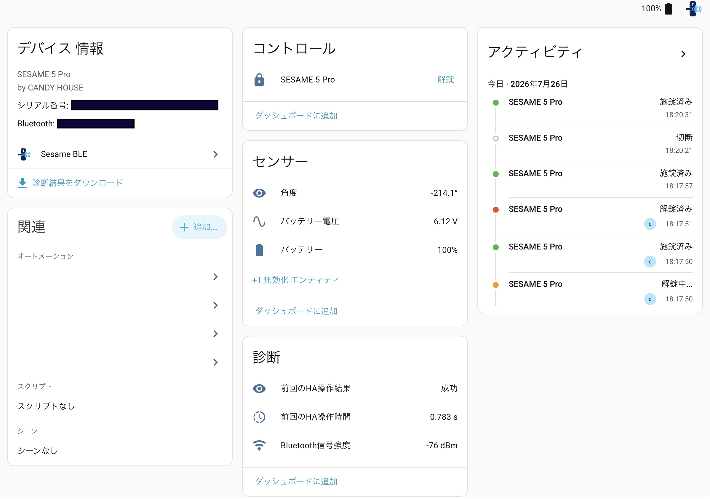

# HA Sesame BLE

<p align="center">
  
</p>

[](https://github.com/bingxyz/ha-sesame-ble/releases)
[](https://github.com/bingxyz/ha-sesame-ble/actions/workflows/ci.yml)
[](https://github.com/bingxyz/ha-sesame-ble/actions/workflows/validate.yml)
[](https://www.hacs.xyz/docs/faq/custom_repositories/)
[](LICENSE)

[English](README.md) | [日本語](README.ja.md) | [繁體中文](README.zh-TW.md)

`ha-sesame-ble`は、CANDY HOUSEのSESAMEスマートロックをHome Assistant
から直接操作しながら、ESP32を標準的で交換可能なBluetooth Proxyとして
維持するカスタムインテグレーションです。ESP32側にSESAME専用のESPHome
componentやファームウェアは必要ありません。

ESP32が1台だけでも、この設計には利点があります。SESAMEの認証、暗号化、
状態、コマンドロジックはHome Assistantが管理し、ESP32は汎用BLE転送だけを
担当するため、ほかのBluetoothデバイスにも引き続き利用できます。

バージョン`0.1.x`は**SESAME 5 Proのみ**をサポートし、ローカルBluetooth
アダプターまたはESPHome Bluetooth Proxy経由で接続できます。

> [!IMPORTANT]
> 初期実装は完成しており、自動テストに加えて、ESPHome Bluetooth Proxy
> 経由で実機のSESAME 5 Proを使った検証も完了しています。Proxyの基本的な
> フェイルオーバーも実機で検証済みです。別のProxyが後から利用可能になった
> 場合の復旧と、稼働中のProxy停止後にオンラインの別Proxyへ自動切り替え
> できることを確認しています。長期的な反復切り替えの安定性は引き続き
> 観察します。

## 🏠 Home Assistantのデバイスページ



ロック、角度、バッテリー、Bluetooth信号強度、操作診断が、Home Assistant
標準のエンティティとして表示されます。

## ✅ 対応モデル

| モデル | 対応状況 |
| --- | --- |
| SESAME 5 Pro | 対応済み・実機で検証済み |
| SESAME 5 | `0.1.x`では無効。基盤ライブラリは対応していますが、このインテグレーションでは未検証です |
| SESAME 5 US | `0.1.x`では無効。基盤ライブラリは対応していますが、このインテグレーションでは未検証です |
| SESAME 6シリーズおよびその他すべてのCANDY HOUSE製品 | 非対応 |

このインテグレーションは、SESAME 5 Pro以外のモデルからのBluetooth
検出を意図的に拒否します。CANDY HOUSEのBluetooth service UUIDを共有する
関連モデルであっても、設定フローには表示されません。各モデルの対応は、
プロトコルと実機での検証後に個別に有効化します。

## 🔐 このプロジェクトの目的

中心となる目的は、ESP32を専用のロックコントローラーにするのではなく、
SESAME固有のロジックをHome Assistant側に置くことです。

- カスタムcomponentなしで、通常のESPHome Bluetooth Proxyを使用
- ESP32を再コンパイル・再書き込みせずに、インテグレーションを更新、
  テスト、デバッグ
- 認証情報、デバイス状態、オートメーション、バックアップ／復元の流れを
  Home Assistantに集約
- 同じESP32をほかのBluetoothデバイスにも再利用
- SESAME専用ファームウェアやロジックを移行せずにESP32を交換

つまり、ESP32をロックコントローラーではなく、交換可能なBluetooth
ネットワークアダプターとして扱います。

Home Assistantに既存の`sesame`インテグレーションは、初代SESAME Lockと
Wi-Fi Access Point向けの旧式クラウドポーリング連携です。SESAME 5 Pro
向けのローカルBLEインテグレーションではありません。

サードパーティーの`esphome-sesame3`は、1台のESP32からSESAMEを直接操作
できますが、プロトコルセッションとロック固有のロジックもそのESP32が
保持します。この構成はHome Assistantを使用しない場合や、制御ロジックを
マイクロコントローラー上で独立して動作させる必要がある場合に適しています。
Home Assistantがすでにシステムの中心であれば、必須ではありません。

プロトコルをHome Assistant側に置くことで、複数Proxyにも追加の利点が
生まれます。すべてのProxyが同じインテグレーション状態を共有し、切断後は
Home Assistantが到達可能なBLE経路を再選択できます。

```text
SESAME 5 Pro
    ↕ BLE
接続可能な任意のESPHome Bluetooth Proxy
    ↕ ESPHome API／ネットワーク
Home Assistant + ha-sesame-ble
```

ESPHome側で必要なのは、標準の接続可能なProxyだけです。

```yaml
esp32_ble_tracker:

bluetooth_proxy:
  active: true
```

このYAMLが提供するのはBLE転送だけです。認証、暗号化、状態管理、施錠・
解錠コマンドは、`gomalock` Pythonライブラリを利用するこのHome Assistant
インテグレーションが実装します。

## ✨ 初期リリースの機能

- SESAME 5 Pro Bluetoothデバイスの自動検出
- Home Assistant UIからの設定
- オーナー／マネージャー共有URLまたは32文字のシークレットキー入力
- 明示的な施錠・解錠操作
- ロック状態、動作不良、利用可否
- 角度、バッテリー残量、バッテリー電圧、Bluetooth信号強度センサー
- 前回のHome Assistant操作結果とエンドツーエンド処理時間の診断
- 上限付きの再接続バックオフと、切断後のHome Assistant BLE経路再選択
- 機密情報を除外した診断情報

## 📊 エンティティ

| エンティティ | デフォルト | 説明 |
| --- | --- | --- |
| ロック | 有効 | 施錠／解錠状態と操作コマンド |
| 角度 | 有効 | 現在の機械角度 |
| バッテリー | 有効 | 推定バッテリー残量 |
| バッテリー電圧 | 無効 | ロックが報告する生の電圧 |
| 信号強度 | 無効 | 直近の接続可能なBLEアドバタイズのRSSI |
| 前回のHA操作結果 | 無効 | 直近のHAコマンドの成功または失敗 |
| 前回のHA操作時間 | 無効 | 直近のHAコマンドのエンドツーエンド処理時間 |
| バッテリー残量低下 | 無効 | SESAMEのバッテリー低下フラグ |

状態はSESAMEの機械状態通知から取得します。ロックの角度が校正済みの
施錠・解錠範囲外にある場合、ロック状態は不明になりますが、角度センサー
は引き続き位置を表示します。

信号強度は、Home AssistantまたはESPHome Bluetooth Proxyが最後に受信した
アドバタイズの診断データです。持続的なGATT接続から取得するリアルタイム
測定値ではないため、接続中は長時間変化しない場合があります。

操作診断の対象はHome Assistantから送信したコマンドだけです。処理時間には
必要な再接続とログイン時間も含まれます。成功はSESAMEがコマンドを受け付けた
ことを意味し、機械的な動作不良はロックエンティティのjammed状態で報告されます。

## 📦 インストール

このリポジトリはHACSのカスタムリポジトリとしてインストールできます。

1. Home Assistantで**HACS**を開きます。
2. メニューから**Custom repositories**を選択します。
3. `https://github.com/bingxyz/ha-sesame-ble`を追加し、カテゴリーに
   **Integration**を選択します。
4. HACSで**Sesame BLE**を開き、**Download**を選択します。
5. Home Assistantを再起動します。
6. 接続可能なBluetoothアダプターまたはESPHome Bluetooth Proxyを通信範囲内に
   設置します。Home Assistantが対応するSESAME 5 Proを自動検出します。

HACSは、Home Assistant設定ディレクトリの`custom_components/`フォルダーに
インテグレーションをインストールします。今後のリリースも、同じHACS
リポジトリエントリーからインストールおよび更新できます。

現在のインテグレーションは、メンテナンスされている
[`bingxyz/gomalock`](https://github.com/bingxyz/gomalock) forkの不変commit
から`gomalock` 2.2.0をインストールします。このforkは、元の
[`meronepy/gomalock`](https://github.com/meronepy/gomalock)プロジェクトに
Home Assistant BLEルーティングと切断hookを追加しています。transport hookが
上流に採用された場合は、将来PyPI releaseへ戻せます。

ローカル開発では、隣接する`../gomalock` checkoutを直接使用します。

```bash
uv sync
uv run pytest
uv run ruff check .
uv run mypy custom_components
```

設定時には、次のどちらか一方だけを指定します。

- オーナー／マネージャーの`ssm://`共有URL
- ロックの16進数32文字のシークレットキー

config entryを保存する前に、実際の暗号化BLEログインを行って認証情報を
検証します。

## 🧭 プロジェクトの範囲

- `ha-sesame-ble`はHome Assistantインテグレーションであり、この
  プロジェクトの主要な成果物としてメンテナンスします。
- `gomalock`は独立したプロトコルライブラリです。このworkspaceには、
  Home Assistantルーティング用の後方互換transport拡張が含まれます。
- `esphome-sesame3`と`libsesame3bt`は有用な参考資料ですが、この
  アーキテクチャのruntime dependencyではありません。
- SESAME履歴の同期と旧型SESAME OS2製品のサポートは、初期リリースの
  対象外です。

すべての分析、設計判断、リスク、実装計画については、
[Research and design](docs/research-and-design.md)（英語）を参照してください。

## 🔗 参考資料

- [CANDY HOUSE APIドキュメント](https://github.com/CANDY-HOUSE/API_document)
- [gomalock upstream](https://github.com/meronepy/gomalock)
- [gomalock HA transport fork](https://github.com/bingxyz/gomalock)
- [esphome-sesame3](https://github.com/homy-newfs8/esphome-sesame3)
- [Home Assistant Bluetooth開発者ドキュメント](https://developers.home-assistant.io/docs/bluetooth/)
- [Home Assistant Bluetooth API](https://developers.home-assistant.io/docs/core/bluetooth/api/)
- [既存のHome Assistant Sesameインテグレーション](https://www.home-assistant.io/integrations/sesame/)
